# Hackathon Submission: The Custom Parts Bureau

## Tagline
**"The 3D printing business that runs itself — and the cage that makes it safe."**

## One-Liner for Tweet
"An AI agent that runs a 3D printing business — earns money, refuses bad jobs with physics reasoning, and operates in an isolated NVIDIA sandbox. Built for the Hermes Agent Hackathon."

---

## Three Pillars

### 1. Self-Sustaining Business
- Agent earns, spends, and manages P&L.
- Makes real business decisions (accept/reject).
- Tracks revenue, margins, and enterprise value.
- *"Not a tool that helps a business — a business that runs itself."*

### 2. Human-in-the-Loop
- Operator dashboard for oversight.
- Human approves the final print queue.
- Agent recommends, human decides.
- *"AI handles the brain, human handles the hands."*

### 3. Enterprise Security
- NemoClaw sandbox isolates untrusted files.
- Network policies block unauthorized access.
- Credentials never exposed to the agent (`inference.local`).
- *"We built the autonomous agent AND the cage."*

---

## Demo Narrative (1-3 min)

### 1. Opening (15s)
*"Most agents say yes to everything. Ours says no."*

### 2. The Refusal (30s)
*Upload a bad STL file.*
The agent analyzes the geometry, triggers Nemotron for physics reasoning, and overrides the quote. The customer screen dramatically flashes **REJECTED**, displaying the exact physics logic explaining why the print would fail.

### 3. The Business (30s)
*Upload a good STL file.*
The system generates a quote, flows seamlessly into the Stripe checkout, and processes the payment. The real-time operator dashboard lights up with the new revenue and margin data.

### 4. The Security (15s)
Show the architecture diagram (below) and the NemoClaw Terminal UI.
*"And the whole thing runs in an isolated sandbox. The agent can't escape, can't steal credentials, and can't access unauthorized services. We have strict SSRF protections and a deny-by-default proxy."*

### 5. Close (15s)
Point to the Operator Dashboard showing revenue, margins, and the accepted/rejected feed.
*"This isn't a demo. It's a business plan."*

---

## The Security Architecture (Visual for Judges)

Display this diagram during the "Security" portion of your pitch.

```mermaid
graph TD
    subgraph "Public Internet"
        User[Customer Web UI]
        Stripe[Stripe API]
    end

    subgraph "Host Machine (Secure)"
        Flask[Flask Application]
        DB[(SQLite Database)]
        Proxy[NemoClaw Egress Proxy\n10.200.0.1:3128]
        Tunnel[Cloudflare Tunnels]
    end

    subgraph "NVIDIA OpenShell Sandbox (Isolated)"
        Agent[Hermes Autonomous Agent]
        Workspace[Read/Write /workspace]
        Inference[inference.local\nManaged Credentials]
    end

    User -->|Upload STL| Flask
    Flask -->|Save Data| DB
    Flask <-->|Secure Tunnels| Tunnel
    Tunnel -->|job.created Webhook| Agent

    Agent -->|Code Execution| Workspace
    Agent -.->|BLOCKED 403 Forbidden| Stripe
    Agent -->|Nemotron Reasoning| Inference
    
    Agent -->|API Request| Proxy
    Proxy -->|Policy Whitelist Check| Tunnel
    
    style Agent fill:#1a1a2e,stroke:#00ff41,stroke-width:2px,color:#fff
    style Proxy fill:#8b0000,stroke:#ff0000,stroke-width:2px,color:#fff
    style Sandbox fill:#0d1117,stroke:#30363d,stroke-width:2px
```

