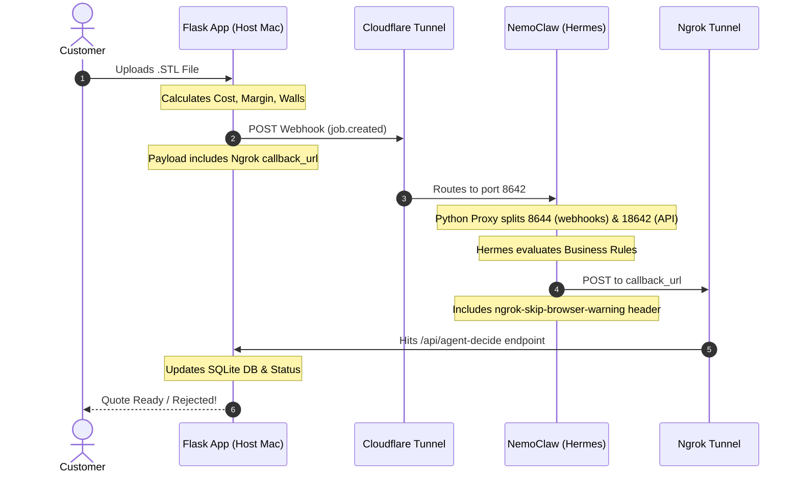

# Custom Parts Bureau — System Architecture

This document breaks down exactly how the automated 3D printing review loop is *supposed* to work from end to end. Review this when you return to get a clear mental model of the moving parts!

## The Two-Way Tunnel Strategy

Because the Hermes AI Agent is locked inside a highly secure **NemoClaw Sandbox**, it cannot talk directly to your Mac's `localhost`. We bridge this gap using two different tunnels:

1. **Cloudflare Tunnel (`nemoclaw tunnel start`)**: Creates a public URL that points *inward* to the Sandbox.
2. **Ngrok (`ngrok http 5001`)**: Creates a public URL that points *inward* to your Mac's Flask app.

## End-to-End Workflow

### Step-by-Step Breakdown

1. **Upload & Analysis:** A customer uploads a 3D model. Your Flask backend (`app.py`) slices it, calculates the margin, checks wall thickness, and generates a quote.
2. **The Webhook:** Flask bundles these stats into a JSON payload and fires it off to `NEMOCLAW_WEBHOOK_URL` (the Cloudflare tunnel). Crucially, the payload contains a `callback_url` built using your `NGROK_URL`.
3. **Agent Evaluation:** The Cloudflare tunnel passes the webhook into the sandbox on port 8642. A custom Python reverse proxy (replacing the default socat) intercepts the traffic, forwarding `/webhooks/*` to the webhook platform (8644) and everything else to the main API server (18642). Hermes wakes up, parses the JSON, and checks your three rules:
   * Margin ≥ $2.50
   * Wall thickness ≥ 0.8mm
   * Structural confidence ≥ 30
4. **The Callback:** Once Hermes decides to `ACCEPT` or `REJECT`, it generates a JSON payload with its decision and reasoning. It then uses Python's `urllib` to send an HTTP POST request to the `callback_url`. 
   * *Note 1: Because we added a custom firewall rule allowing `*.ngrok-free.app`, the strict NemoClaw proxy permits this request to leave the sandbox.*
   * *Note 2: The request includes the `ngrok-skip-browser-warning: 1` header to bypass Ngrok's free tier interstitial page.*
5. **Database Update:** The HTTP POST travels through Ngrok and hits the `/api/agent-decide/<job_id>` endpoint on your Flask app. Flask automatically updates the SQLite database with the decision, shifting the job out of the "analyzing" state so the customer can proceed to checkout!

## Why This Architecture?

We initially tried to have the agent write directly to the SQLite database. However, this required mounting your Mac's local directory into the sandbox via `macfuse`, which triggers annoying Apple Silicon security blocks (Recovery Mode). 

By switching to **HTTP Callbacks via Ngrok**, we bypass the need for any local filesystem sharing entirely. The sandbox remains fully isolated, and the communication happens safely over secure HTTP tunnels.
